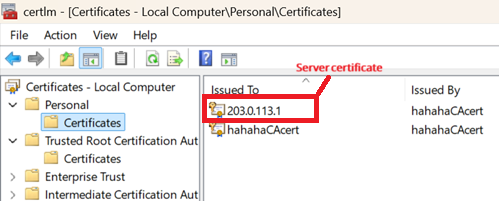
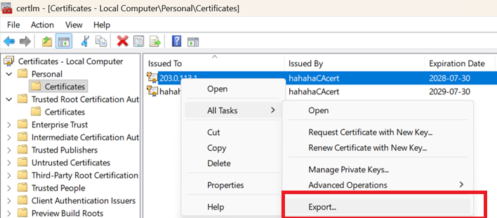
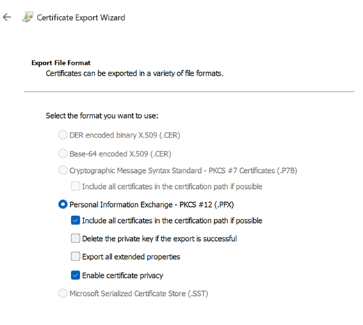
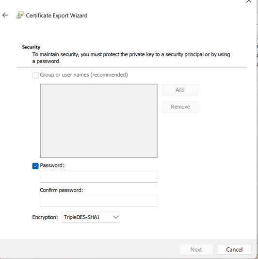
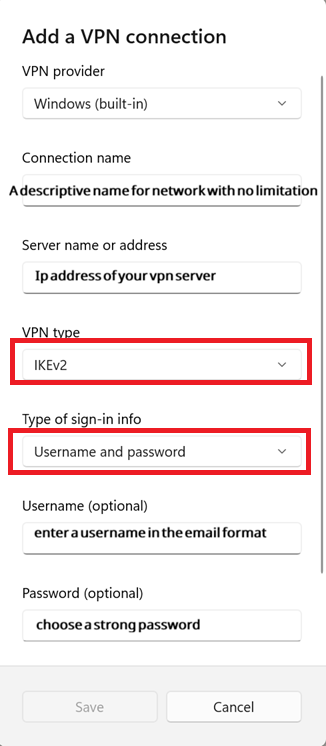
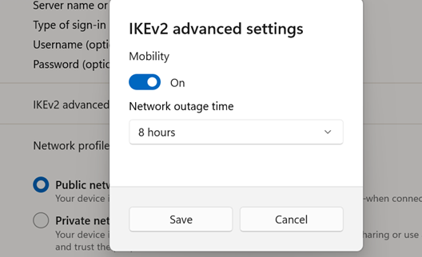

# IKEv2 Server

<p> This project is an IKEv2 server that does not rely on L2TP, and instead, all IP layer traffic is encapsulated inside encrypted UDP packets.
When deployed on AWS EC2 instance, it listens on its UDP port 4500 and 500 for connection and routes any traffic to its public IP interface. Due to different OS implementations, I have set up two types of clients. The normal one is for Android use and the special one (with windows inside its connection name) is for Windows client use.</p>

## Highlights
<ol>
<li>
<p> Covers both Android and Windows 11 user (Perhaps other Windows too, though this project has only been tested on Windows 11.)</p>
</li>
<li>
<p> Windows configuration covers strong algorithms like AES-256-GCM and ECDSA P-384 / SHA-384. </p>
</li>
<li>
Readily usable
</li>
</ol>

## Note
<ol>
<li>
<p> The Windows client used here is Windows 11.</p>
</li>
<li>
<p> Left in ipsec.conf means the vpn server and right means the incoming client. </p>
</li>
<li>
<p> Rightsubnet in ipsec.conf means the network that the left side (the server in this case) will route the traffic to. For example,
by setting rightsubnet to 172.20.1.0/24, only the traffic whose destination address falls into this range will travel back to this client.
The same concept applies to the leftsubnet. By setting leftsubnet to 0.0.0.0/0, it means any traffic from the client will travel to the VPN server (the left side). </p>
</li>
  <li>
    You have to manually force Windows to adopt a strong cipher suites. See this https://serverfault.com/questions/965244/strongswan-ikev2-vpn-on-windows-10-client-policy-match-error for workaround. 
  </li>
</ol>

## How to run the IKEV2 vpn server.

<p> I have chosen AWS EC2 to run my project, but of course you can use other instances. A micro instance is more than enough for this case. </p>

<p> You will need a permanent IP address because you need to bake the IP address into your remote server certificate. </p>

<ol>
<li>
Create a VPC first. Basically VPC is a private LAN in AWS cloud. There are so many tutorial online and it is easy to setup so I am not detailing it here.
</li>
<li>
Go to AWS EC2 panel and find the section <b> Elastic IPs </b> to get a permanent IP address.
<br>

</li>
<li>
Press Allocate Elastic IP address and leave the setting as default. Press Allocate.
<br>

<br>

</li>
<li>
Go to EC2 panel again and press <b>Security Groups</b> and then create Security group. Security groups are just firewall rules installed on the public gateway of your VPC. The firewall rules act on each instance inside the VPC via port mapping. 
<br>

</li>
<li>
Create four security group for this project :
<ul>
<li>
Inbound rules (type: Custom TCP, Port Range: 4500, source: Anyway-IPv4 <b>Unless you have a client with a permanent ip address, then enter that IP address</b>) 
</li>
<li>
Inbound rules (type: Custom TCP, Port Range: 500, source: Anyway-IPv4 <b>Unless you have a client with a permanent ip address, then enter that IP address</b>) 
</li>
<li>
Inbound rules (type: SSH, source: Anyway-IPv4 <b>Unless you have a client with a permanent ip address, then enter that IP address</b>) 
</li>
<li>
Outbound rules (type: All Traffic, Destination: Anyway-IPv4)
</li>
</ul>
</li>
<li>
Go to EC2 panel again and press <b>Instance</b>. Then press <b>Launch Instances</b>
<br>

<br>

</li>
<li>
Choose Ubuntu (Or other linux version. However, this project is only tested on ubuntu 24.04).
</li>
<li>
Choosing a t3.micro should be enough for now. <b>No need to Auto-assign public IP</b> because you have a permanent IP address already. Select the above <b>four security groups</b>. Check out and launch the instance
</li>
<li>
Go to Elastic IPs panel again and select the IP address that you have just set up. Press <b> Action </b> and then <b> Associate Elastic IP address </b> to associate the ip address to your newly created instance.
</li>
<li>
Connect to your instance either in web browser or ssh. Install docker engine. 
</li>
<li>
Pull this repo into your instance and cd into the project directory.
</li>
<li>
Run to start the IPSec VPN server: 

```
sudo docker compose up IKEV2-server --detach
```
</li>
</ol>


## How to set up IKEv2 vpn for Android client.

<ol>
<li>
Add a connection in ipsec.conf. You can copy and paste any connection whose name does not contain windows and then change: 
<ul>
<li>
Connection name next to conn.
</li>
<li>
Rightid in the format of email (A random one like tonyhau@abcd.com etc).
</li>
<li>
Non-overlapping right sourceip range with other connections in the ipsec.conf file that will be distributed to the incoming client 
</li>
<li>
Corresponding rightsubnet (the subnet that the incoming client belongs to).
</li>
</ul>
</li>
<li>
Add the corresponding PSK entry in ipsec.secrets. The PSK key should be made as complex and long as possible.
</li>
<li>
Please add the subnet entered above in all the iptables protections under ikev2-server-start.sh.
</li>
<li>
Add a vpn config file to your android phone like this.
<br>

</li>
</ol>

## How to set up IKEv2 vpn for Windows client.

<p> I have chosen EAP-MSCHAPV2 and Public key authentication for Windows. The meaning for this is that the windows client will authenticate the vpn server using public key authentication whereas the vpn server authenticates the client using eap-mschapv2. So the following tutorial will begin with how to set up a public key for authentication first.</p>

<p> A quick recap on how public key certification works. The server holds a certificate issued by a Certificate Authority (CA). The CA <b>signs</b> the certificate using the CA's own private key — it does not encrypt it. The client already has the CA's public key pre-installed in its trust store (e.g. built into the OS). When the client receives the server's certificate during the handshake, it uses the trusted CA's public key to verify the CA's signature on it. A valid signature proves the certificate is genuine and was not tampered with. The certificate itself contains the server's public key, which the client can then use to encrypt data that only the server (holding the matching private key) can read.</p>

<pre>
  Certificate Authority (CA)
  ┌──────────────────────────────────┐
  │  CA Private Key                  │
  │  CA Public Key  ─────────────────┼──► pre-installed in client trust store
  └────────────┬─────────────────────┘
               │ signs with CA Private Key
               ▼
  Server Certificate
  ┌──────────────────────────────────┐
  │  Server's Public Key             │
  │  Server Identity (e.g. hostname) │
  │  CA's Digital Signature          │
  └────────────┬─────────────────────┘
               │ sent to client during handshake
               ▼
  Client
  ┌──────────────────────────────────────────────────────┐
  │                                                      │
  │  CA Public Key (trusted, pre-installed)              │
  │       │                                              │
  │       │ verifies CA's digital signature              │
  │       │ on the received server certificate           │
  │       ▼                                              │
  │  Signature valid → certificate is genuine            │
  │       │                                              │
  │       │ extract Server's Public Key from certificate │
  │       ▼                                              │
  │  Server's Public Key                                 │
  │       │                                              │
  │       │ encrypt messages to server                   │
  │       │ (only server's private key can decrypt)      │
  │       ▼                                              │
  │  Secure channel established                          │
  └──────────────────────────────────────────────────────┘
</pre>

### Setting up the Certificate Authority on the Windows client

<ol>
<li>
Run Windows Powershell as adminstrator and run the following command to produce a Certificate Authority: <b>Change Subject to meaningful names like CN=hahahaCAcert etc and DO NOT CLOSE THE POWERSHELL AFTER RUNNING THIS COMMAND!</b>

```
$rootParams = @{
    Type = 'Custom'
    Subject = 'CN=hahahaCAcert'
    KeyExportPolicy = 'Exportable'
    KeyUsage = 'CertSign'
    KeyAlgorithm = 'ECDSA_P384'
    HashAlgorithm = 'sha384'
    NotAfter = (Get-Date).AddMonths(36)
    CertStoreLocation = 'Cert:\LocalMachine\My'
}
$rootCert = New-SelfSignedCertificate @rootParams
```
</li>
<li>
Run the following command on the same powershell session to produce a server certificate signed by the Certificate Authority above: <b> Change the Subject and the TextExtension to the public ip address of your vpn server. E.g. CN=203.0.113.1 and IPAddress=203.0.113.1</b> Close the powershell after running the command.

```
$serverParams = @{
    Type = 'Custom'
    Subject = 'CN=203.0.113.1'
    Signer = $rootCert
    KeyExportPolicy = 'Exportable'
    KeyUsage = 'DigitalSignature', 'KeyEncipherment'
    # 2.5.29.37 is the OID for Extended Key Usage
    # 1.3.6.1.5.5.7.3.1 = ServerAuth
    # 1.3.6.1.5.5.8.2.2 = IP Security Server End System
    TextExtension = @(
        "2.5.29.17={text}IPAddress=203.0.113.1",
        "2.5.29.37={text}1.3.6.1.5.5.7.3.1,1.3.6.1.5.5.8.2.2"
    )
    KeyAlgorithm = 'ECDSA_P384'
    HashAlgorithm = 'sha384'
    NotAfter = (Get-Date).AddMonths(24)
    CertStoreLocation = 'Cert:\LocalMachine\My'
}
New-SelfSignedCertificate @serverParams
```
</li>

<li>
Press <b>Windows + R</b> and run the following command to open the Local Computer Certificates:
```
certlm.msc
``` 
</li>
<li>
Search for the <b>Certificates</b> under <b>Personal</b>. You will find two files. One bears the name of the ip address you have entered above for the server certificate. <b>This is the server certificate.</b> Another one bears the name of the Root CA name you have entered above. <b>This is the Root CA</b>.
<br>

</li>

<li>
Find the Root CA you have just made and pull it to <b>Certificates</b> under <b>Trusted Root Certification Authorities</b>.
<br>

</li>
</ol>

### Exporting the server certificate and private key
<ol>
<li>
Under the <b>Certificates</b> of <b>Personal</b> above, find the server certificate (which should bear the ip address of the remote vpn server you have entered above).
<br>

</li>

<li>
Right click and find the <b>Export</b> under <b>All Tasks</b>. A window will appear. Click <b>Next</b>. Then click <b>Yes, export the private key</b> in the <b>Export Private Key</b>. Left all to be default as follows in <b>Export File Format</b> and click <b>Next</b>. 
<br>

<br>

</li>
<li>
Enter a password to protect your private key. Click <b>Next</b> and then choose a path and a file name to export the pfx document that contains both the server private key and its certificate.
<br>

</li>
<li>
You can delete the server certificate (which bears the ip address) safely (not the Certificate authority) since it is not used in the windows client when it is authenticating the server.
</li>
</ol>

### Installing the server certificate and private key on vpn server
<ol>
<li>
On Linux run the following command to export the private key: <b>(replace the pfx file in -in option to the one you have)</b>. You will be prompted to enter the password that you have just created when generating the pfx file above. You will be prompted then to enter a new password to protect the private key.

```
openssl pkcs12 -in <your-export>.pfx -nocerts -out myvpnprivatekey.key
```

</li>
<li>
Run the following command to remove the password protection of the private key by passing in the password you have just created. (I guess you can skip this step if you want to protect the private key with password. You then need to alter the config in ipsec.secrets yourself, which should be easy).

```
openssl ec -in myvpnprivatekey.key -outform PEM -out myvpnprivatekey.pem
```

</li>
<li>
Run the following command to get the server certificate:

```
openssl pkcs12 -in <your-export>.pfx -clcerts -nokeys -out myvpnservercert.crt
```

</li>
<li>
Put the two files under config/secrets/ikev2. Modify <b>ipsec-server-secrets</b> and point the : ECDSA myvpnprivatekey.pem to the pem file you have put under the ikev2 folder. Just enter the name of the pem file is enough, no need to put in the path.
</li>
<li>
Modify also leftcert under ipsec.conf to the server certificate name you have just put under the folder. File name is enough, no need to enter file path. Enter the leftca with the Certificate Authority name you have made above. (In the example above it is CN=203.0.113.1).
</li>

</ol>

### Setting up EAP-MSCHAPV2 credentials
<ol>
<li>
Open your Windows VPN setting and enter the following info. Choose the options boxed in red.
<br>

</li>
<li>
Enter the username and password you have just made in ipsec.secrets. Following the example there.
</li>
<li>
Modify the right source ip and right source net just as in the android settings above.
</li>
</ol>

### Modifying the iptable rules in ikev2-server-start.sh
Please also do the same as android phone section above.

### Manually setting the cipher suites used by Windows11
To force Windows IPSec to use strong cipher suites as adopted in my ipsec.conf connection for windows client, run the following command:

```
Set-VpnConnectionIPsecConfiguration -ConnectionName "<your-vpn-name>" `
    -AuthenticationTransformConstants "GCMAES256" `
    -CipherTransformConstants "GCMAES256" `
    -DHGroup "ECP384" `
    -EncryptionMethod "AES256" `
    -IntegrityCheckMethod "SHA384" `
    -PfsGroup "SHA384" -Force
```

This corresponds to a strongswan setting of 

>ike = aes256gcm16-prfsha384-ecp384 <br>
>esp = aes256gcm16-ecp384 <br>
>leftauth = pubkey-ecdsa-384-sha384

### Manually setting the network outage time
Go to your windows IPSec profile and find <b>IKEv2 Advanced Settings</b>. Set <b>Network outage time</b> to <b>8 hours</b> to prevent the IPSec connection from dropping out if no traffic is detected. (See IPSec dead pear detection for more) (I have also set <b>dpddelay=8h</b> in ipsec.conf to correspond to this setting.)
<br>


# L2TP server and router

<p> This project is a rudimentary L2TP server and client
pair that has no IPSec functionality that exists in normal use. 
This is due to the fact that IPSec/L2TP (i.e. IKEv1) is already a legacy application and hence I do not want to further make the IPSec layer. Plus, the usual traffic via VPN is itself encrypted (like HTTPS) and therefore a raw L2TP connection still has its use.
</p>

<p>The server is deployed on AWS EC2 and accepts incoming traffic on UDP 1701 port for VPN service. 

On the other hand, the L2TP client is in the form
of a router that routes any traffic coming from its network interface (defined by the parameter NETWORK_INTERFACE_TO_BE_FORWARDED) to the remote VPN server so that any subnet attached to the interface can use the VPN service.
</p>

## How to start the L2TP router
This project has only been tested on Ubuntu 24.04. To start this router, you need to
<ol>
<li>
Choose the ethernet port on your local machine that you want to route the traffic. (For example the ethernet name can be eth0).
</li>
<li>
Paste that name to the environment variable NETWORK_INTERFACE_TO_BE_FORWARDED of l2tp-router in compose.yaml in the project directory.
</li>
<li>
Paste the ip address of the remote server to the environment variable L2TP_SERVER_ADDR of l2tp-router in compose.yaml in the project directory.
</li>
<li>
Set up your username and password in router-chap-secrets and server-chap-secrets. Note that MSCHAP-V2 is bilateral authentication. So both the server and the router has to authenticate itself. Therefore, you need to store both <b>your username and password and the other side's username and password </b> in both router-chap-secrets and server-chap-secrets.
</li>
<ol>

## How to start the L2TP server
Follow the steps in setting up a IKEv2 server above and start the L2TP-server. Remember to open the 1701 UDP port in security group.

<p> Note 1: The MTU and MRU of the L2TP client side should be set to 1460 because the
MTU of the docker network adapter is set to 1500. (L2TP header is 40 byte) <p>

# To-do for L2TP server and router
<ul>

<li>
<p>Add a diconnect script to L2TP client pppd<p>
</li>

<li>
<p>Tell the user where to find the variables sanity check</p>
</li>

<li>
<p>Tell the user how to enter two required variables for router (none for server)</p>
</li>

<li>
<p>Explain each term carefully, like what NETWORK_INTERFACE_TO_BE_FORWARDED means (Although they are
>pretty much self-explanatory)</p>
</li>
</ul>

# To-do for IPSec server
<ul>
  <li>
    <p>To bypass China GFW inspection, I am planning to use TLS obfuscation, i.e. IPSec packet wrapped inside TLS tunnel, aka UDP-over-TLS. It is to emulate a commonly seen web traffic via port 443 so that GFW can't detect the usual port 4500 UDP traffic. Tools include Xray.</p>
  </li>
</ul>

---

## License

Copyright (C) 2026 Tony HAU

This project is licensed under the [GNU Affero General Public License v3.0](LICENSE).

You are free to use, modify, and distribute this project, provided that:
- Any modified version that is run as a network service must also make its source code publicly available under the same licence.
- The original copyright notice and licence must be retained in all copies or substantial portions of the project.
